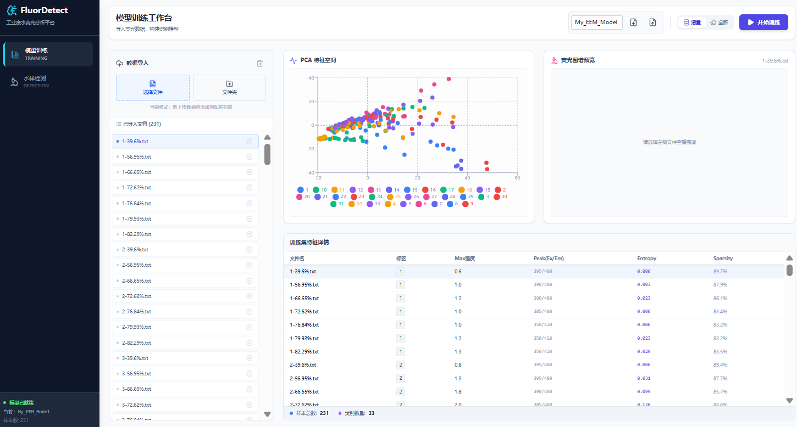
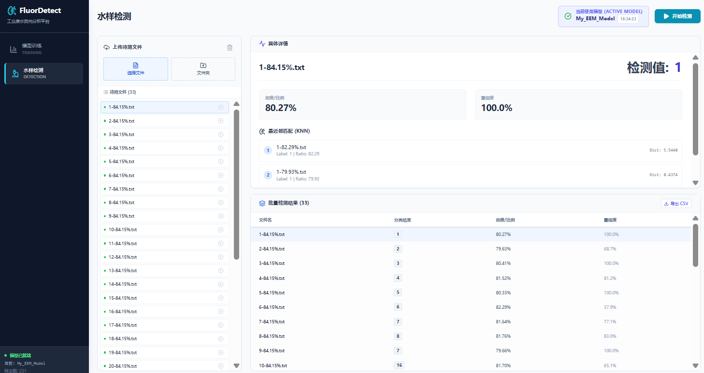

# FluorDetect AI

**工业废水荧光指纹分析溯源平台 (Industrial Wastewater EEM Analysis Platform)**

FluorDetect AI 是一个基于浏览器的专业水质分析工具，利用三维荧光激发-发射矩阵（EEM）光谱技术结合机器学习算法（PCA + KNN），实现对工业废水的快速分类与浓度预测。
访问地址：https://whimsical-dragon-3f6670.netlify.app/

## 界面预览 (Screenshots)

### 1. 模型训练工作台 (Model Training)
展示数据导入、PCA 特征空间聚类分析及 EEM 荧光图谱可视化。



### 2. 水样检测界面 (Water Detection)
展示未知水样上传、KNN 最近邻匹配分析及详细的预测报告。



## 核心功能 (Features)

### 1. 模型训练 (Model Training)
*   **数据导入**: 支持批量导入 `.txt` 格式的 EEM 荧光光谱数据。
*   **特征提取**: 自动提取包括峰值位置、信息熵、稀疏度、行列轮廓等多种维度的光谱特征。
*   **PCA 可视化**: 实时生成主成分分析（PCA）散点图，直观展示样本在特征空间中的分布聚类情况。
*   **模型管理**: 支持模型训练、浏览器本地存储以及模型的导入/导出（JSON格式）。

### 2. 水样检测 (Water Detection)
*   **智能识别**: 上传待测水样文件，系统自动匹配已训练的模型进行预测。
*   **详细报告**: 提供预测分类、浓度/比例估算以及置信度评分。
*   **KNN 分析**: 展示最近邻样本（Nearest Neighbors）及其距离，增强结果的可解释性。
*   **批量导出**: 支持将检测结果批量导出为 CSV 表格。

## 技术栈 (Tech Stack)

*   **Core**: React 19, TypeScript
*   **Build Tool**: Vite
*   **Visualization**: D3.js (Heatmaps), Recharts (PCA Scatter Plots)
*   **Styling**: Tailwind CSS
*   **Icons**: Lucide React

## 本地运行 (Run Locally)

1. **安装依赖**:
   ```bash
   npm install
   ```

2. **启动开发服务器**:
   ```bash
   npm run dev
   ```

3. **构建生产版本**:
   ```bash
   npm run build
   ```

## 部署 (Deployment)

本项目完全基于前端计算（Edge/Client-side Computing），无需复杂的后端服务，非常适合部署在 Vercel、Netlify 或 GitHub Pages 上。

1. Fork 本仓库。
2. 在 Vercel 中导入项目。
3. Framework Preset 选择 **Vite**。
4. 点击 Deploy 即可。
